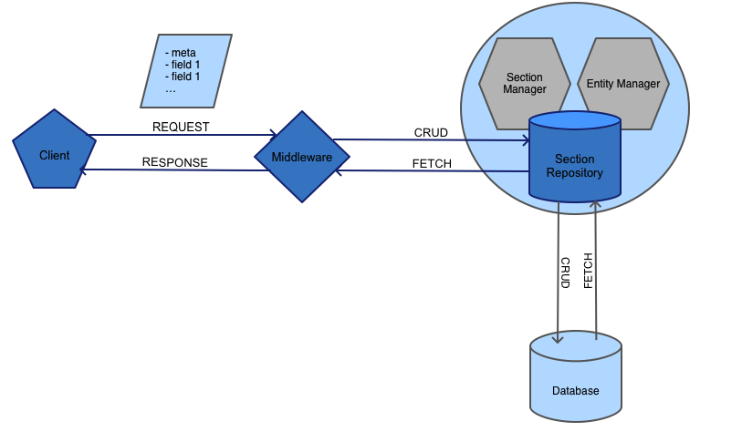

# Fig / RFC


## Abstract

## T.o.c.

- [Content blueprints](#content-blueprints)

- [Content blocks](#content-blocks)

- [Fields](#fields)
  - [Fieldtypes](#fieldtypes)
  - [Datatypes](#datatypes)


### Content Blueprints

#### Overview

Content blueprints describe the nature of [content blocks](#content-blocks) using [fields](#fields).

#### General Architecture


##### Schema

```
sections:

-----------------------------------------------------------------------

- int id
- string   name
- string   handle
- char(36) uuid

-----------------------------------------------------------------------

```

### Content Blocks

#### Architecture data abstraction strategies

###### Data De-normalisation I

###### Data De-normalisation II

### Fields

#### Overview
A Field abstracts a persistant object (**Entity**) that accepts one value and is capable to retrieve that value in a consistant way. 

##### Schema

```
fields:

-----------------------------------------------------------------------

- int      id
- int      type_id
- string   label
- string   handle
- text     settings
- char(36) section_id
- bool     required
- string   validate
- enum     position
- int      sorting 

-----------------------------------------------------------------------

```
#### Fieldtypes

Fieldtypes describe the nature of a field and controls how I/O values are transformed for persistance and retreival. 

##### Schema

```

field_types:

-----------------------------------------------------------------------

- int      id
- string   name       (charackter, e.g markdown, text, input, etc.)
- string   type       (datatype) 
- text     defaults   (predef. settings)
- char(36) section_id
- bool     required
- string   validate
- enum     position
- int      sorting 

-----------------------------------------------------------------------

```

#### Datatypes

Datatypes are the true value objects deticated to one **scalar** data type *(string, integer, double…)*. 


